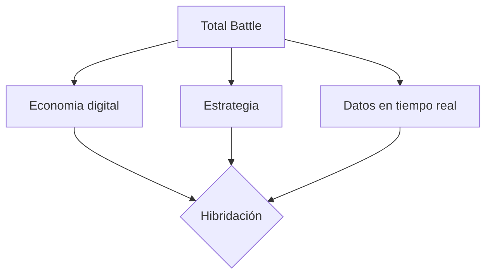

# PEC3_Manovich_Reloaded  

**Autor:** Carol Ayala i Solà
**Asignatura:** Cultura Digital / Multimedia  
**Fecha:** 03/05/2026. 

## Introducción: El software como nuevo lenguaje cultural  
  
En esta nueva entrega, adoptamos la perspectiva de Lev Manovich en *El software toma el mando* (2013) para exponer y ejemplificar que el software ya no es únicamente una herramienta orientada  a un fin, como en sus inicios, ni es una mera evolución de un tiempo analógico pasado. En la actuallidad, el software también redefine, mezcla y genera nuevos medios culturales. Sí,  hablamos de **hibridación**. Manovich define esta evolución perfectamente en la página 179: "Una vez los ordenadores se transformaron en cómodas casas donde habitaban un sinfín de medios simulados y nuevos, es natural esperar que empezarían a generar híbridos."
  
En este punto, a mi entender surge una pregunta clave: hasta dónde podemos llegar con la hibridación? Más allá de los usos prácticos del software -programas productivos, divulgatorios y educativos que usamos en nuestro dia a dia- la parte lúdica que atreae al ser humano aflora y toma su sitio en la cultura digital contemporánea. Es por eso que en este ensayo analizamos dos formas en que el software traduce experiencias humanas a sistemas interactivos lúdicos: el juego de estrategia *Total Battle* y el juego musical *Guitar Hero*. Ambos ejemplos permiten analizar cómo el software reconfigura experiencias opuestas —la guerra y la música— en sistemas interactivos basados en datos, interfaces y algoritmos.

## Caso 1: Total Battle
  
*Total Battle* es un juego interactivo multijugador de estrategia para móviles donde los jugadores construyen imperios, gestionan recursos y dirigen ejércitos en un entorno competitivo. Para poder ofrecer esta experiencia, su desarrollador ScoreWarrior combina planificación urbanística individual con táctica de grupo para poder progresar a través de eventos y enfretamientos bélicos. 

Podemos confirmar que es una evolución significativa de los juegos de estrategia clásicos como *Age of Empires* o *Caesar III*. Sin embargo, la diferencia no radica únicamente en las complejidades añadidas o en la participación en tiempo real sino que es una **hibridación entre estrategia, economía digital y sistemas de datos en tiempo real**:

Por un lado mantiene la estrategia clásica que tanto atrae a los amantes de juegos bélicos como la gestión territorial, la propia táctica para conseguir recursos, obtener mejores resultados y buenas alianzas. Por otro lado, incorpora economía digital que se ve traducida en recursos obtenidos a lo largo del juego que sirven para poder comprar bienes y progresar. Cuantas más tropas y más actualizados se tengan los edificios más se progresa. La economía digital es visible también en las microtransacciones que permite el juego para poder evolucionar más rápidamente. Finalmente, el sistema de datos en tiempo real se transmite podiendo interactuar a todas horas con otros jugadores y en los eventos mundiales determinados a horas concretas del día.

Desde la perspectiva de Lev Manovich, Total Battle permite identificar varios de los principios fundamentales de los nuevos medios. Destaca la **transcodificación** mediante la cual, el juego nos convierte una guerra -tradicionalmente entendida en los juegos como una experiencia visual y narrativa basada en la acción directa- en un sistema de porcentajes, tiempos y números. El software en si mismo opera con estos datos y revela el resultado de las batallas, por ejemplo. El jugador participa eligiendo los soldados y el objetivo pero no ve un escenario de batalla, sino que espera los resultados de un cálculo algorítmico.

## Bibliografia y webgrafia
El software toma el mando
