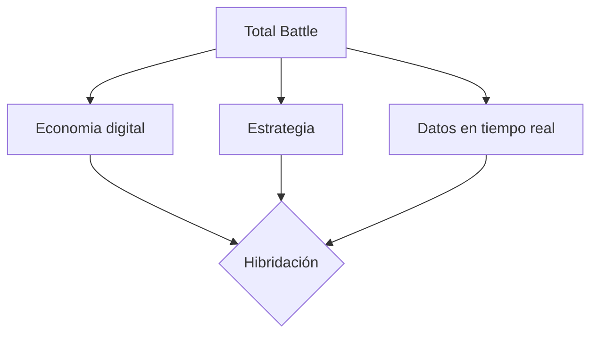

# PEC3_Manovich_Reloaded  

**Autor:** Carol Ayala i Solà

**Asignatura:** Cultura Digital / Multimedia  

**Fecha:** 03/05/2026. 

## Introducción: El software como nuevo lenguaje cultural  
  
En esta nueva entrega, adoptamos la perspectiva de Lev Manovich en *El software toma el mando* (2013) para exponer y ejemplificar que el software ya no es únicamente una herramienta orientada  a un fin, como en sus inicios, ni es una mera evolución de un tiempo analógico pasado. En la actualidad, el software también redefine, mezcla y genera nuevos medios culturales. Sí,  hablamos de **hibridación**. Manovich define esta evolución perfectamente en la página 179: "Una vez los ordenadores se transformaron en cómodas casas donde habitaban un sinfín de medios simulados y nuevos, es natural esperar que empezarían a generar híbridos."
  
En este punto, a mi entender surge una pregunta clave: ¿hasta dónde podemos llegar con la hibridación? Más allá de los usos prácticos del software -programas productivos, divulgatorios y educativos que usamos en nuestro día a día- la parte lúdica que atrae al ser humano aflora y toma su sitio en la cultura digital contemporánea. Es por eso que en este ensayo analizamos dos formas en que el software traduce experiencias humanas a sistemas interactivos lúdicos: el juego de estrategia *Total Battle* y el juego musical *Guitar Hero*. Ambos ejemplos permiten analizar cómo el software reconfigura experiencias opuestas —la guerra y la música— en sistemas interactivos basados en datos, interfaces y algoritmos.

## Caso 1: Total Battle
  
*Total Battle* es un juego interactivo multijugador de estrategia para móviles donde los jugadores construyen imperios, gestionan recursos y dirigen ejércitos en un entorno competitivo. Para poder ofrecer esta experiencia, su desarrollador ScoreWarrior combina planificación urbanística individual con táctica de grupo para poder progresar a través de eventos y enfretamientos bélicos. 

En primer lugar, en el ámbito más técnico de la hibridación, podemos confirmar que Total Battle es una evolución significativa de los juegos de estrategia clásicos como *Age of Empires* o *Caesar III*. Sin embargo, la diferencia no radica únicamente en las complejidades añadidas o en la participación en tiempo real sino que es una **hibridación entre estrategia, economía digital y sistemas de datos en tiempo real**.

Por un lado mantiene la estrategia clásica que tanto atrae a los amantes de juegos bélicos como la gestión territorial, la propia táctica para conseguir recursos, obtener mejores resultados y buenas alianzas. Por otro lado, incorpora economía digital que se ve traducida en recursos obtenidos a lo largo del juego que sirven para poder comprar bienes y progresar. Cuantas más tropas y más actualizados se tengan los edificios más se progresa. La economía digital es visible también en las microtransacciones que permite el juego para poder evolucionar más rápidamente. Finalmente, el sistema de datos en tiempo real se transmite podiendo interactuar a todas horas con otros jugadores y en los eventos mundiales determinados a horas concretas del día.

Desde la perspectiva de Lev Manovich, Total Battle permite identificar varios de los principios fundamentales de los nuevos medios. Destaca la **transcodificación** mediante la cual, el juego nos convierte una guerra -tradicionalmente entendida en los juegos como una experiencia visual y narrativa basada en la acción directa- en un sistema de porcentajes, tiempos y números. El software en si mismo opera con estos datos y revela el resultado de las batallas, por ejemplo. El jugador participa eligiendo los soldados y el objetivo pero no ve un escenario de batalla, sino que espera los resultados de un cálculo algorítmico.

Asimismo, el juego presenta una gran variabilidad, ya que la experiencia no es fija ni cerrada, al contrario; se modifica a través de eventos y de la interacción de otros jugadores, generando constantemente múltiples desenlaces posibles. Esta condición convierte al juego en un sistema dinámico en lugar de una experiencia lineal y predeterminada.

Por otro lado, vemos la hibridación de Lev Manovich también en la **automatización** del software. El jugador dirige pero no ejecuta directamente la mayoría de las acciones. Dicho de otra manera; programa procesos —como la construcción de edificios o el entrenamiento de tropas— que el sistema lleva a cabo de manera autónoma. Esto ubica su rol en una figura más cercana a la de gestor de sistemas que a la de actor directo. Aunque en este caso, también encontramos este rol en otros juegos más clásicos. 

En segundo lugar, desde una perspectiva más sociológica, la hibridación en Total Battle no solo mezcla medios, sino que transforma una experiencia compleja como la guerra en un sistema basado en datos accesible para el usuario.

Lo que en los inicios de los videojuegos se representaba como un conflicto visual y narrativo relativamente lineal, se convierte aquí en una lógica de gestión, cálculo y toma de decisiones, situando al jugador en una posición similar a la de un General estratega. Esta transformación modifica profundamente la relación del usuario con la experiencia: el jugador ya no observa la guerra ni se deja guiar solo por la narrativa, sino que ahora opera activamente dentro de un sistema.

En este sentido, el desarrollo del juego ya no depende de una historia predeterminada, sino de la interacción entre jugadores y de la gestión de variables dentro del software, lo que refuerza la idea de que éste no solo representa la realidad, sino que la reconfigura constántemente.

## Caso 2: Guitar Hero

Guitar Hero es un videojuego para amantes de la música con cierta destreza manual. El jugador debe seguir el ritmo de una canción mediante un mando con forma de guitarra. En la pantalla aparecen los botones necesarios para llegar a tocar la canción elegida. A diferencia de otros juegos musicales tradicionales, no se limita a reproducir canciones, sino que convierte la experiencia musical en una interacción directa y constante entre el usuario y el sistema.

Desde la perspectiva de la hibridación propuesta por Lev Manovich, Guitar Hero representa una combinación entre música, videojuego e interfaz física. Un tipo de hibridación en auge a inicios y mediados de los años 2000. El software se encarga de transformar una actividad artística y expresiva en una secuencia de datos digitales interpretables por el sistema. La música no es únicamente sonido sinó que se convierte también en información visual, tiempos de reacción y mecánicas de juego.

El punto fuerte de esta hibridación aparece especialmente en la forma en que el software traduce la música a un lenguaje interactivo. Uno de los conceptos más visibles es la *transcodificación*, ya que se convierten las canciones en datos procesables por el sistema. Visualmente, las notas musicales se representan mediante colores y patrones que el jugador debe interpretar con su mando. Dicho de otra manera; el software convierte la experiencia musical en una secuencia de instrucciones jugables.

Guitar Hero incorpora también el principio de *automatización*. Aunque el mando lo sugiere, el jugador no produce realmente música, sino que interactúa con un sistema programado que decide cuándo una acción es correcta y cuándo no. El software interpreta las pulsaciones del usuario y genera una respuesta audiovisual inmediata, creando la falsa sensación de estar tocando una guitarra auténtica. Esto provoca que la experiencia musical dependa de algoritmos y reglas digitales.

Otro aspecto importante es la relación entre cuerpo e interfaz. A diferencia de otros videojuegos convencionales, Guitar Hero introduce un mando diseñado específicamente para imitar una guitarra eléctrica. Aunque se trata de una simulación, el jugador desarrolla una interacción física que acerca la experiencia digital a una puesta en escena donde el usuario adopta simbólicamente el rol de músico.

## Bibliografia y webgrafia
El software toma el mando
https://es.wikipedia.org/wiki/Guitar_Hero
