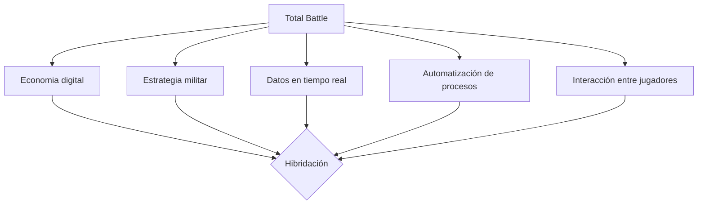
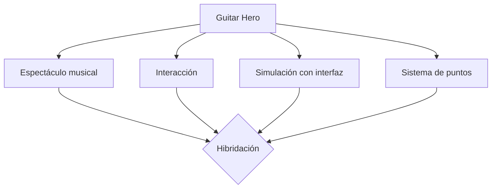

# PEC3_Manovich_Reloaded  

**Autor:** Carol Ayala i Solà

**Asignatura:** Cultura Digital / Multimedia  

**Fecha:** 03/05/2026. 

## Introducción: El software como nuevo lenguaje cultural  
  
En esta nueva entrega, adoptamos la perspectiva de Lev Manovich en *El software toma el mando* (2013) para exponer y ejemplificar que el software ya no es únicamente una herramienta orientada  a un fin, como en sus inicios, ni es una mera evolución de un tiempo analógico pasado. En la actualidad, el software también redefine, mezcla y genera nuevos medios culturales. Sí,  hablamos de **hibridación**. Manovich define esta evolución perfectamente en la página 179: "Una vez los ordenadores se transformaron en cómodas casas donde habitaban un sinfín de medios simulados y nuevos, es natural esperar que empezarían a generar híbridos."
  
En este punto, a mi entender surge una pregunta clave: ¿hasta dónde podemos llegar con la hibridación? Más allá de los usos prácticos del software -programas productivos, divulgatorios y educativos que usamos en nuestro día a día- la parte lúdica que atrae al ser humano aflora y toma su sitio en la cultura digital contemporánea. Es por eso que en este ensayo analizamos dos formas en que el software traduce experiencias humanas a sistemas interactivos lúdicos: el juego de estrategia *Total Battle* y el juego musical *Guitar Hero*. Ambos ejemplos permiten analizar cómo el software reconfigura experiencias opuestas —la guerra y la música— en sistemas interactivos basados en datos, interfaces y algoritmos.

## Caso 1: Total Battle
  
*Total Battle* es un juego interactivo multijugador de estrategia para móviles donde los jugadores construyen imperios, gestionan recursos y dirigen ejércitos en un entorno competitivo. Para poder ofrecer esta experiencia, su desarrollador ScoreWarrior combina planificación urbanística individual con táctica de grupo para poder progresar a través de eventos y enfrentamientos bélicos. 

En primer lugar, en el ámbito más técnico de la hibridación, podemos confirmar que Total Battle es una evolución significativa de los juegos de estrategia clásicos como *Age of Empires* o *Caesar III*. Sin embargo, la diferencia no radica únicamente en las complejidades añadidas o en la participación en tiempo real sino que es una **hibridación que incluye estrategia, economía digital y sistemas de datos en tiempo real**.

Por un lado mantiene la estrategia clásica que tanto atrae a los amantes de juegos bélicos como la gestión territorial, la propia táctica para conseguir recursos, obtener mejores resultados y buenas alianzas. Por otro lado, incorpora economía digital que se ve traducida en recursos obtenidos a lo largo del juego que sirven para poder comprar bienes y progresar. Cuantas más tropas y más actualizados se tengan los edificios más se progresa. La economía digital es visible también en las microtransacciones que permite el juego para poder evolucionar más rapidamente. Finalmente, el sistema de datos en tiempo real se transmite podiendo interactuar a todas horas con otros jugadores y en los eventos mundiales determinados a horas concretas del día.

Desde la perspectiva de Lev Manovich, Total Battle permite identificar varios de los principios fundamentales de los nuevos medios. Destaca la **transcodificación** mediante la cual, el juego nos convierte una guerra en un sistema de porcentajes, tiempos y números. El software en si mismo opera con estos datos y revela el resultado de las batallas, por ejemplo.

Asimismo, el juego presenta una gran **variabilidad**, ya que la experiencia se modifica a través de eventos y de la interacción con otros jugadores, generando constantemente múltiples desenlaces posibles. Esta condición convierte al juego en un sistema dinámico en lugar de una experiencia lineal y predeterminada.

Otro de los principios que se pueden apreciar es la **automatización** del software. El jugador dirige pero no ejecuta directamente la mayoría de las acciones. Dicho de otra manera; programa procesos —como la construcción de edificios o el entrenamiento de tropas— que el sistema lleva a cabo de manera autónoma. Aunque en este caso, también encontramos esta situación en los juegos clásicos mencionados. 

En segundo lugar, desde una perspectiva más sociológica, la hibridación en Total Battle no solo mezcla medios, sino que transforma una experiencia compleja como la guerra en un sistema basado en datos accesible para el usuario. Lo que en los inicios de los videojuegos se representaba como un conflicto visual y narrativo relativamente lineal, se convierte aquí en gestión, cálculo y toma de decisiones. Esta transformación modifica profundamente la relación del usuario con la experiencia: el jugador ya no observa la guerra ni se deja guiar solo por la narrativa, sino que ahora opera activamente dentro de un sistema bélico, lo que refuerza la idea de que el software no solo representa la realidad, sino que la reconfigura constántemente al uso de los jugadores.

En mi opinión, en este caso la hibridación permite saciar uno de los deseos más oscuros del ser humano; el conflicto bélico, situando al jugador en una posición similar a la de un General estratega. 

## Caso 2: Guitar Hero

Guitar Hero es un videojuego para amantes de la música con cierta destreza manual. El jugador debe seguir el ritmo de una canción mediante un mando con forma de guitarra. En la pantalla aparecen los botones necesarios para llegar a tocar la canción planteada. A diferencia de otros juegos musicales tradicionales como *Parapa the Rapper*, no se limita a reproducir canciones a las que el jugador tiene que imitar, sino que convierte la experiencia musical en una interacción directa y constante entre el usuario y el sistema.

Desde la perspectiva de la hibridación propuesta por Lev Manovich, Guitar Hero representa una combinación entre música, videojuego e interfaz física. Un tipo de hibridación en auge a inicios y mediados de los años 2000 en distintos tipos de videojuego. El software se encarga de transformar una actividad artística y expresiva viva en una secuencia de datos digitales interpretables por el sistema.

Uno de los principios más visibles es la **transcodificación**, ya que se convierten las canciones en datos procesables por el sistema. Visualmente, las notas musicales se representan mediante colores y patrones que el jugador debe interpretar con su mando. 

Guitar Hero incorpora también el principio de **automatización**. Aunque el mando lo sugiere, el jugador no produce realmente música, sino que interactúa con un sistema programado que decide cuándo una acción es correcta y cuándo no. El software interpreta las pulsaciones del usuario y genera una respuesta audiovisual inmediata, creando la falsa sensación de estar tocando una guitarra auténtica. Esto provoca que la experiencia musical dependa de algoritmos y reglas digitales.

Otro aspecto importante y especial es la relación entre cuerpo e interfaz. A diferencia de otros videojuegos convencionales y como se ha mencionado anteriormente, Guitar Hero introduce un mando diseñado específicamente para imitar una guitarra eléctrica. Aunque se trata de una simulación, el jugador desarrolla una interacción física que acerca la experiencia digital a una puesta en escena donde el usuario adopta el rol de músico.

En este caso, la hibridación surge de la integración entre música, videojuego e interfaz física, transformando la práctica musical en una experiencia interactiva gobernada por software.

Por otro lado, el videojuego también presenta **variabilidad**, ya que la posibilidad de desbloquear canciones, aumentar niveles de dificultad o competir por puntuaciones convierte la experiencia musical en un proceso único, dinámico y personalizado. Además, cada canción modifica la experiencia del usuario dado que el ritmo, la velocidad y la dificultad cambian en cada una de ellas.

Desde una perspectiva sociológica, Guitar Hero simplifica la complejidad de aprender un instrumento musical para convertirla en un sistema basado en recompensas, reflejos y puntuaciones. En la época de la inmediatez este punto es fundamental; el usuario ya no necesita años de formación musical para sentirse capaz de reproducir canciones de alta complejidad. El software se encarga de traducir esa complejidad a mecánicas intuitivas. 

## Conclusiones
Los dos casos analizados ejemplifican cómo el software contemporáneo ya no actúa únicamente como una herramienta, sino como un medio que a través de la mezcla de diversos elementos es capaz de transmitir al usuario una experiencia nueva y cada vez más sensorial, participativa, cambiante y compleja. Tanto Total Battle como Guitar Hero transforman actividades originalmente vinculadas al mundo físico —la estrategia militar y la interpretación musical— en sistemas interactivos basados en datos, interfaces y algoritmos que se alejan de la remediación dado que ofrecen al consumidor algo distinto a lo conocido.

Siguiendo la visión de Lev Manovich, observamos cómo conceptos como transcodificación, automatización, modularidad y variabilidad aparecen integrados de forma natural en ambos ejemplos. El software convierte acciones humanas en información procesable y redefine la relación entre usuario y experiencia cultural.

En el ámbito más sociológico, la hibridación descrita por Lev Manovich está a la orden del día desde inicios de los 2000 y en auge a día de hoy. Los dos casos expuestos reflejan una característica propia de la sociedad digital: la necesidad de participación constante. Escuchar música o "jugar a la guerra" deja de ser una actividad pasiva para convertirse en una experiencia interactiva. O dicho de otra manera, el entretenimiento ya no se basa únicamente en consumir contenido, sino en participar activamente dentro del sistema y parece ser que cada vez hay menos límites. 

## Bibliografia y webgrafia
Manovich, L. (2013). El software toma el mando. Editorial UOC.

https://es.wikipedia.org/wiki/Guitar_Hero

https://niveloculto.com/brevisima-historia-de-los-juegos-musicales/
